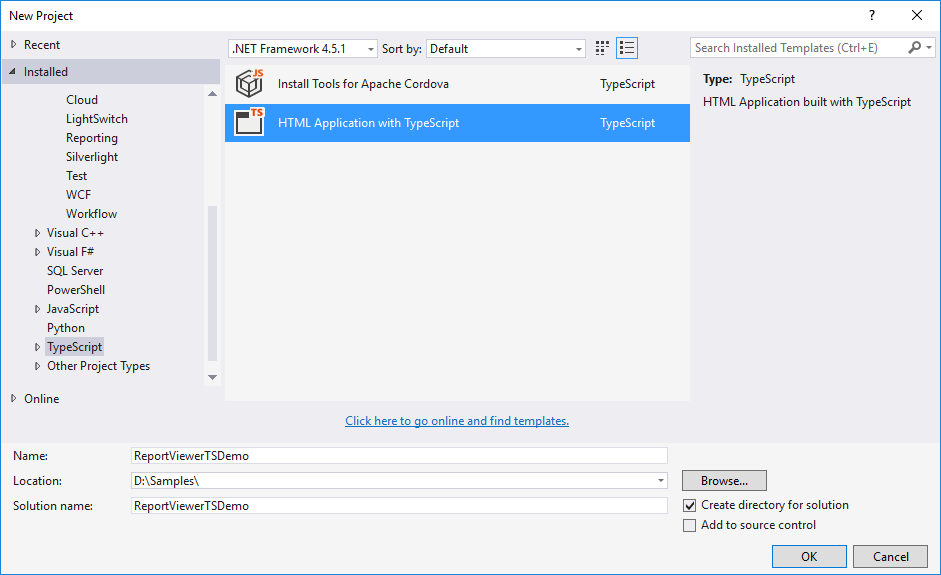

# Getting Started

This section explains briefly about how to create a ReportViewer in your web application Typescript.

## Create your first ReportViewer in Typescript

Open Visual Studio and create a new project by clicking New Project. Select the Typescript category, choose the HTML Application with TypeScript template, and then click OK. The following screenshot displays the Project Creation Wizard.

 

Project Creation Wizard
{:.caption}

For common steps of typescript , you can also refer [here](https://help.syncfusion.com/js/typescript).

The default type definition file ej.web.all.d.ts needs to include the support for type-checking while initializing any of the Syncfusion widgets. 

The important step you need to do is to copy the ej.web.all.d.ts file into your project and then need to refer it in your TypeScript application (app.ts file), so that you will get the intelliSense support and also the compile time type-checking.

You can find the ej.web.all.d.ts file in the following location,

(installed location)\Syncfusion\Essential Studio\{{ site.releaseversion }}\JavaScript\assets\typescript

Apart from ej.web.all.d.ts file, it is also necessary to make use of the jquery.d.ts file in your TypeScript application, which can be downloaded from [here](https://github.com/DefinitelyTyped/DefinitelyTyped).

## Script and CSS Reference

Add the scripts and CSS references to the “index.html” page as the order mentioned in the following code example.



<!DOCTYPE html>
<html>
<head>
    <link href="http://cdn.syncfusion.com/{{ site.releaseversion }}/js/web/bootstrap-theme/ej.web.all.min.css" rel="stylesheet" />
    
    
    
    
    
</head>
<body>
</body>
</html>



In the above code, `ej.web.all.min.js` script reference has been added for demonstration purpose. It is not recommended to use this for deployment purpose, as its file size is larger since it contains all the widgets. Instead, you can use [CSG](http://csg.syncfusion.com/# "") utility to generate a custom script file with the required widgets for deployment purpose.

### Control Initialization

Add a `div` container to render the ReportViewer.



<!DOCTYPE html>
<html>    
     <body>
         

     </body>
</html>



Initialize the ReportViewer in app.ts file by using the `ej.ReportViewer` method.



/// <reference path="../tsfiles/jquery.d.ts"></reference>
/// <reference path="../tsfiles/ej.web.all.d.ts"></reference>

module ReportViewerComponent {
    $(function () {
        var report = new ej.ReportViewer($("#groupingAggregate"), {
            reportServiceUrl: 'http://js.syncfusion.com/ejservices/api/ReportViewer',
            processingMode: ej.ReportViewer.ProcessingMode.Remote,
            reportPath: 'GroupingAgg.rdl',
            isResponsive: true
        });
    });
}



N> Default RDL Report will be rendered, which is used in the online service. You can obtain sample rdl/rdlc files from Syncfusion installed location (%userprofile%\AppData\Local\Syncfusion\EssentialStudio\{{ site.releaseversion }}\Common\Data\ejReportTemplate).

### Run the Application

Run the sample application and you can see the ReportViewer on the page as displayed in the following screenshot.

 

ReportViewer with Grouping Aggregate Report
{:.caption}

## Load SSRS Server Reports

ReportViewer supports to load RDL/RDLC files from SSRS Server. The following steps help you to load reports from SSRS Server.

1. Add a `div` container to render the ReportViewer.



<!DOCTYPE html>
<html>    
     <body>
         

     </body>
</html>



2. Set the `reportPath` from SSRS and SSRS `reportServerUrl` in the ReportViewer properties.



/// <reference path="../tsfiles/jquery.d.ts"></reference>
/// <reference path="../tsfiles/ej.web.all.d.ts"></reference>

module ReportViewerComponent {
    $(function () {
         var report = new ej.ReportViewer($("#territoryReportViewer"), {
            reportServiceUrl: 'http://js.syncfusion.com/ejservices/api/ReportViewer',
            reportServerUrl: 'http://mvc.syncfusion.com/reportserver',
            processingMode: ej.ReportViewer.ProcessingMode.Remote,
            reportPath: "/SSRSSamples2/Territory Sales new",
            isResponsive: true
        });
    });	
}



3. Run the application and you can see the ReportViewer on the page as displayed in the following screenshot.

    
   
   Report from SSRS
   {:.caption}

## Load RDLC Reports

The ReportViewer has data binding support to visualize the RDLC reports. The following code example helps you to bind data to ReportViewer.

1. Add a `div` container to render the ReportViewer.



<!DOCTYPE html>
<html>    
     <body>
         

     </body>
</html>



2. Assign the RDLC report path to ReportViewer’s `reportPath` property and set the data sources to the ReportViewer’s `dataSources` property and specify the `processingMode` as local.


/// <reference path="scripts/jquery.d.ts" />
/// <reference path="scripts/ej.widgets.all.d.ts" />

module ReportViewerComponent {
    $(function () {
        var report = new ej.ReportViewer($("#areaCharts"), {
            reportServiceUrl: 'http://js.syncfusion.com/ejservices/api/ReportViewer',
            processingMode: ej.ReportViewer.ProcessingMode.Local,
            reportPath: 'AreaCharts.rdlc',
            dataSource: [{
                value: [
                    { SalesPersonID: 281, FullName: 'Ito', Title: 'Sales Representative', SalesTerritory: 'South West', Y2002: 0, Y2003: 28000, Y2004: 3018725 },
                    { SalesPersonID: 282, FullName: 'Saraiva', Title: 'Sales Representative', SalesTerritory: 'Canada', Y2002: 25000, Y2003: 14000, Y2004: 3189356 },
                    { SalesPersonID: 283, FullName: 'Cambell', Title: 'Sales Representative', SalesTerritory: 'North West', Y2002: 12000, Y2003: 13000, Y2004: 1930885 },
                    { SalesPersonID: 275, FullName: 'Blythe', Title: 'Sales Representative', SalesTerritory: 'North East', Y2002: 19000, Y2003: 47000, Y2004: 4557045 },
                    { SalesPersonID: 276, FullName: 'Mitchell', Title: 'Sales Representative', SalesTerritory: 'South West', Y2002: 28000, Y2003: 46000, Y2004: 5240075 },
                    { SalesPersonID: 277, FullName: 'Carson', Title: 'Sales Representative', SalesTerritory: 'Central', Y2002: 33000, Y2003: 49000, Y2004: 3857163 },
                    { SalesPersonID: 278, FullName: 'Vargas', Title: 'Sales Representative', SalesTerritory: 'Canada', Y2002: 11000, Y2003: 14000, Y2004: 1764938 },
                    { SalesPersonID: 279, FullName: 'Reiter', Title: 'Sales Representative', SalesTerritory: 'South East', Y2002: 32000, Y2003: 26000, Y2004: 2811012 }
                ],
                name: 'AdventureWorksXMLDataSet'
            }],
            isResponsive: true
        });
    });
}



N> Default RDLC Report will be rendered, which is used in the online service.

3. Run the application and you can see the ReportViewer on the page as displayed in the following screenshot.

    
   
   Area Chart RDLC Report
   {:.caption}

