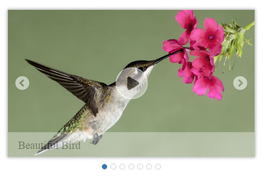
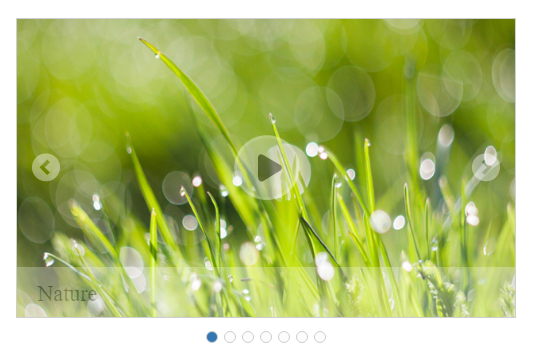

# Getting Started

This section helps to get started of the Rotator control in a typescript application.

 

## Create a Rotator

The following step by step guidelines will help you to add a Rotator control.

1) Refer the common Typescript [Getting Started Documentation]() to create an application and add necessary scripts and styles for rendering the Rotator control.

2) Create an HTML page and add the scripts and css references in the order mentioned in the following code example.



<!DOCTYPE html>
<html>
<head>
    <title>Typescript Application</title>
    <link href="http://cdn.syncfusion.com/**{{**site.releaseversion**}}**/js/web/flat-azure/ej.web.all.min.css" rel="stylesheet" />
    
    
</head>
<body>
    <!--Add Rotator code here-->
</body>
</html>



3) Add the below mentioned code with in the <body> tag to render the Rotator control in the application. 



    

        <ul id="sliderContent">
            <li>
                
            </li>
            <li>
                
            </li>
            <li>
                
            </li>
            <li>
                
            </li>
            <li>
                
            </li>
            <li>
                
            </li>
            <li>
                
            </li>
        </ul>
    



## Initialize the control

Initialize the Rotator in ts file by using the ej.Rotator method.



    /// <reference path="../tsfiles/jquery.d.ts" />
    /// <reference path="../tsfiles/ej.web.all.d.ts" />\

 module RotatorComponent {
    $(function () {
        var rotatorInstance = new ej.Rotator($("#sliderContent"), {
            slideWidth: "100%",
            frameSpace: "0px",
            slideHeight: "auto",
            displayItemsCount: "1",
            navigateSteps: "1",
            pagerPosition:"outside",
            orientation: "horizontal",
            showPager: true,
            enabled: true,
            showCaption: true,
            allowKeyboardNavigation: true,
            showPlayButton: true,
            isResponsive:true,
            animationType: "slide",
        });
    });
 }



Get the following output from the above mentioned code

> _Note:_ _You can find the Rotator properties from the_ [API reference](https://help.syncfusion.com/api/js/ejrotator) _document_

