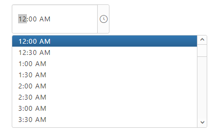

# TimePicker Customization

The **TimePicker** provides support to display a **TimePicker** in your web page and allows you to pick a time from it.

## Creating TimePicker Widget

The following steps explains you to create a **TimePicker** widget.

In an **HTML** page, add a **&lt;input&gt;** element to configure **TimePicker** widget.



<input type="text" id="time" />




/// <reference path="tsfiles/jquery.d.ts" />
/// <reference path="tsfiles/ej.web.all.d.ts" />
    // You can render TimePicker control as follows.
    $(function () {
        var timeSample = new ej.TimePicker($("#timepick"), {
            popupWidth: "400px",
            height: "60px",
            width:"200px"
    });
    


The following screenshot illustrates you a default **TimePicker**.

 

